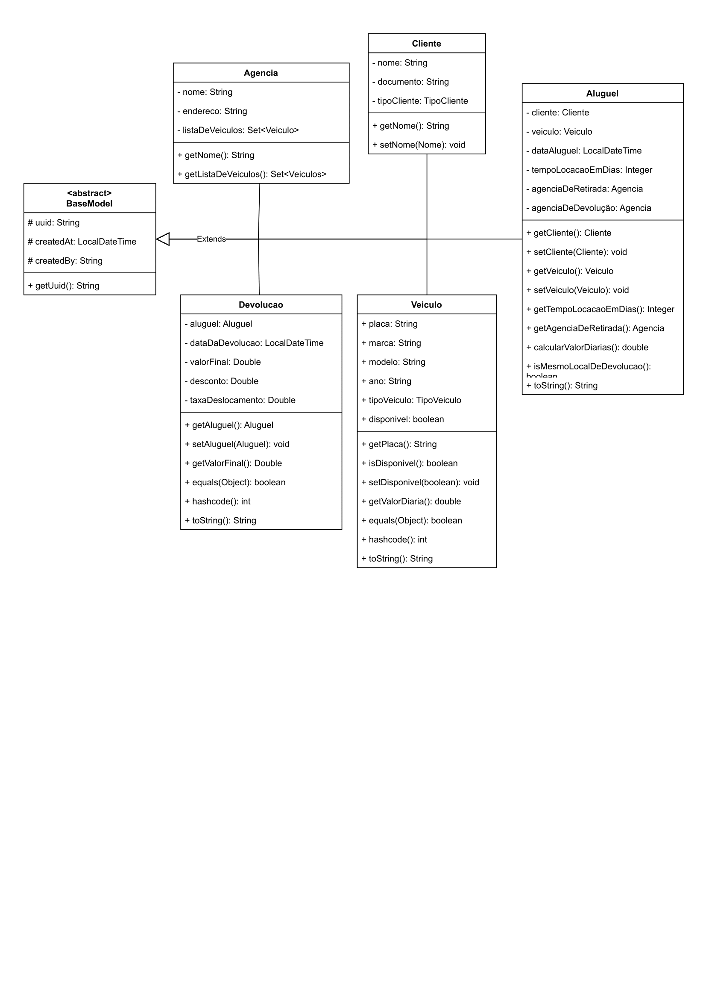
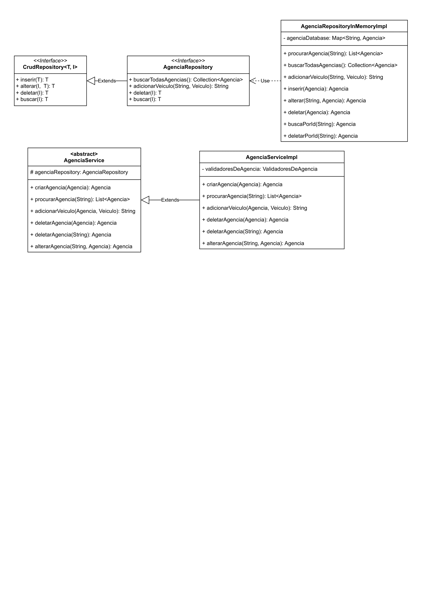
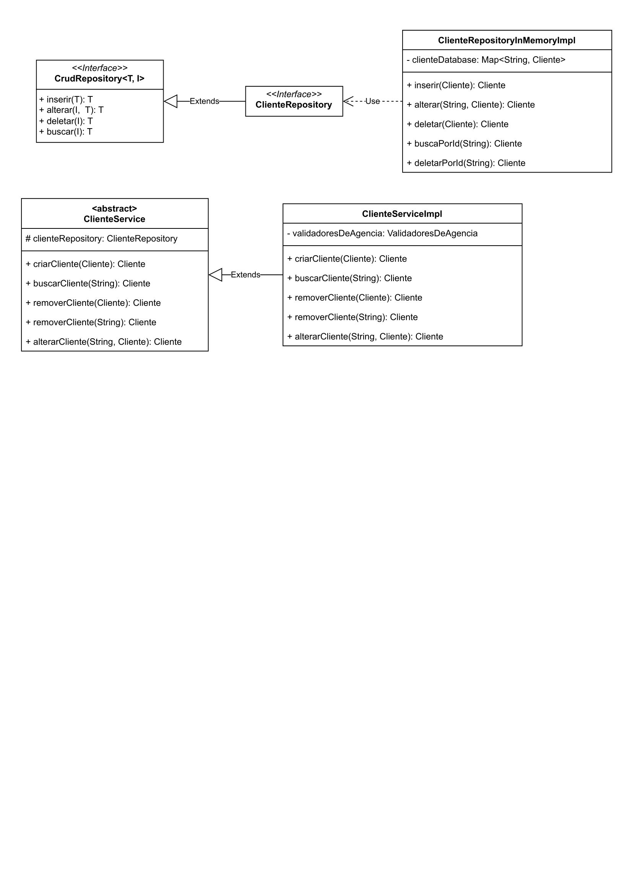
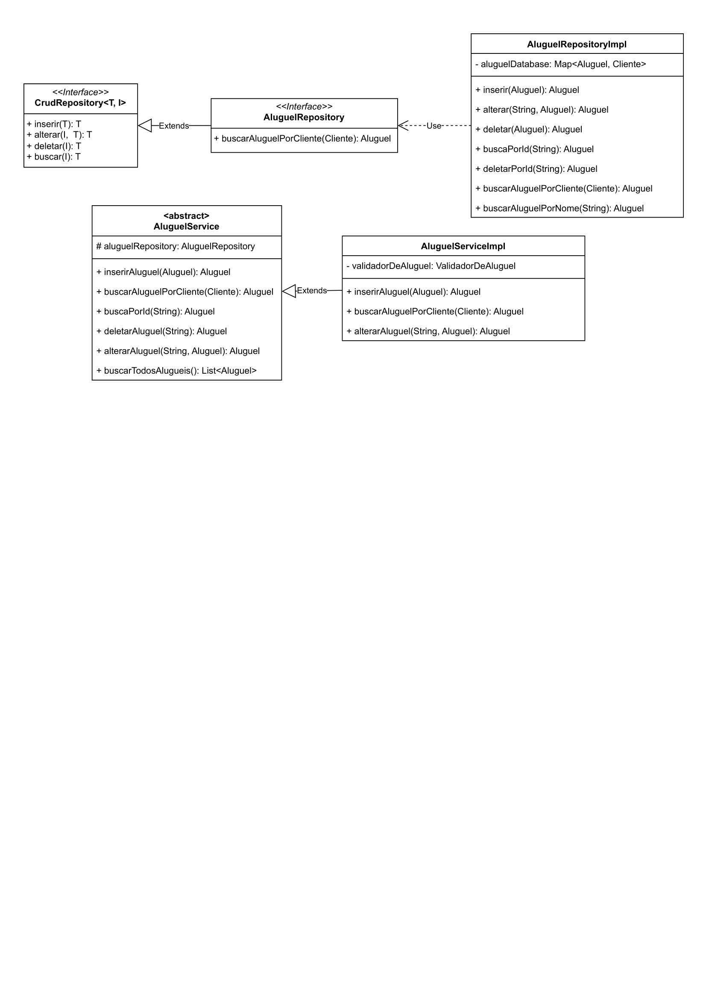
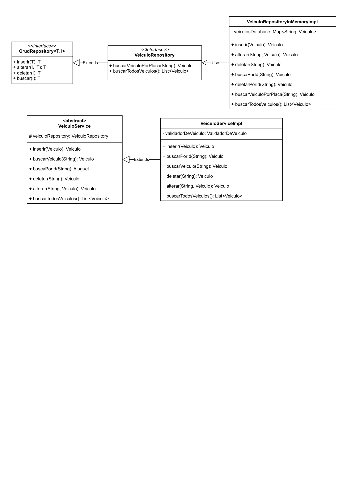
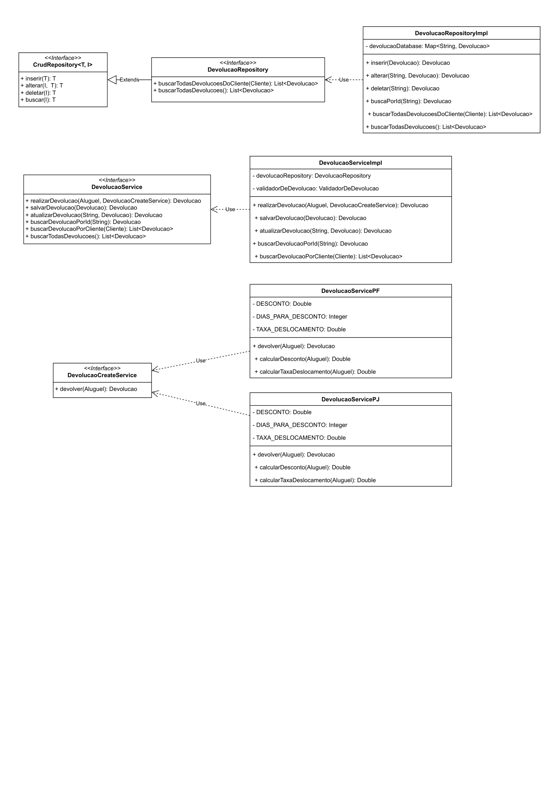
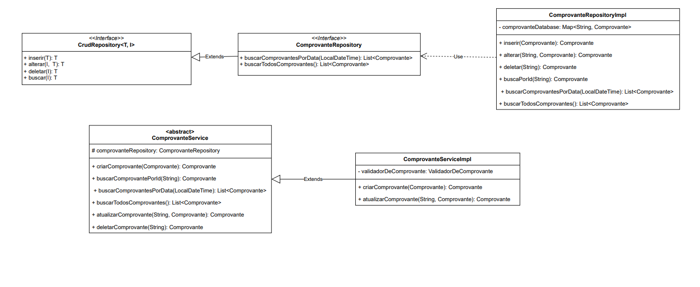

# PROJETO LOCADORA

## BaseModel

## CrudRepository -> Agencia

## CrudRepository -> Client

## CrudRepository -> Aluguel

## CrudRepository -> Veículo

## CrudRepository -> Devolução

## CrudRepository -> Comprovante
